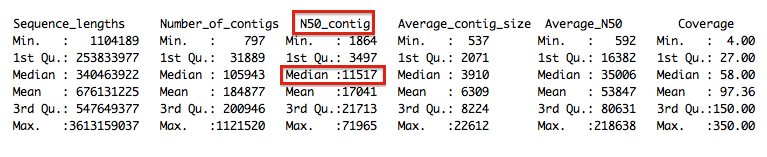
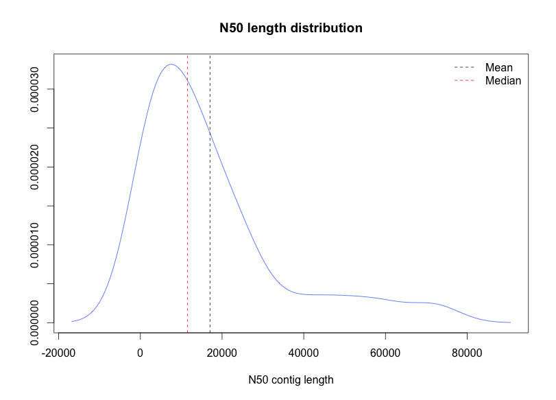
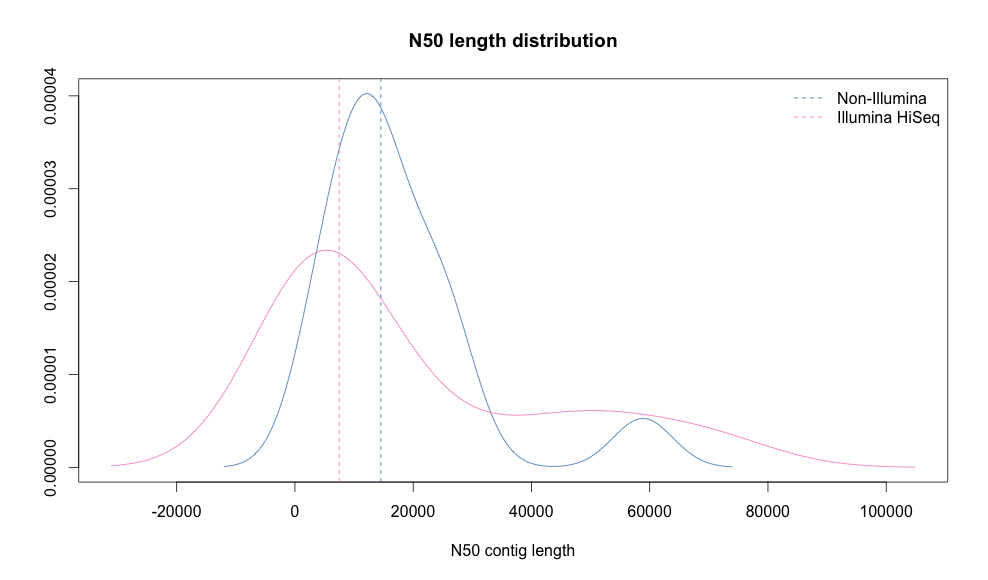
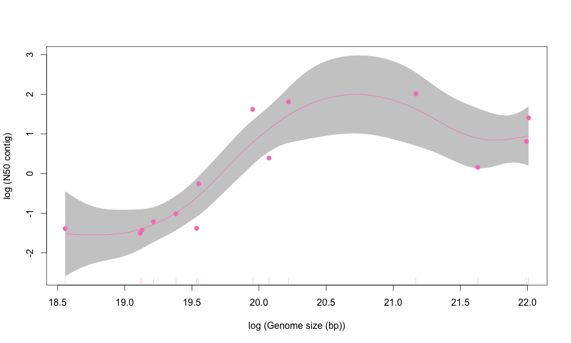

Contig assembly analysis
===

I compared different assemblies by looking at how the technology used, the genome size or genome coverage affected the N50 contig length. I also calculated the average contig length, by dividing the genome size by the number of contigs obtained for each assembly and the average N50 by dividing the genome size by the N50 contig length.

### Selection criteria
- Genome assembly at contig level available at NCBI
- January 2013-now
- Full genome representation
- Genome coverage > 1x
- Sequence technology and N50 contig provided


Species|Genome_length|Number_of_contigs|N50|Coverage|Technology
-----|-----|-----|-----|-----|-----:
Actinidia chinensis|604,217,145|26,721 | 58,864| 150.0x|Illumina HiSeq
Selaginella kraussiana | 114,502,747 | 105,943 | 2,414  | 150.0x | Illumina HiSeq
Sesamum indicum | 340,463,922 |87,064 | 11,517 | 85.0x | 454; Illumina; Illumina MiSeq
Eragrostis tef | 607,317,615 |112,599 | 7,532  | 54.0x |454; Illumina HiSeq
Thlaspi arvense| 343,012,389 |31,889 | 28,155 | 80.0x | Illumina HiSeq; Illumina MiSeq; PacBio
Catharanthus roseus| 522,653,749 |147,992 |14,288| 50.0x | Illumina HiSeq
Raphanus sativus|341,476,849|20,507 | 24,475 |267.0x| 454; PacBio; Illumina HiSeq; ABI3730
Primula veris|309,692,940 |40,851 | 13,157 | 116.0x | Illumina HiSeq; Illumina MiSeq; PacBio
Conyza canadensis |326,165,195 |20,075 | 20,748| 350.0x|454; Illumina HiSeq;PacBio
Diospyros lotus |1,104,189 |797 | 1,864| 23.0x| Illumina HiSeq
Arabidopsis thaliana (Ler-0) |127,419,454|378 |11,163,166| 140.0x| PacBio
Vigna radiata |463,085,359 |23,499 | 48,831 | 300.0x | Illumina HiSeq
Vaccinium macrocarpon |414,621,889 |200,946 | 4,278 | 20.0x | Illumina GAIIx
Raphanus raphanistrum  |253,833,977 |64,732 | 10,186 | 47.0x | Illumina GAII; 454
Nicotiana otophora |2,474,110,067 |1,121,520 | 11,316 | 66.0x| Illumina HiSeq
Glycine soja |806,921,190|128,699 | 24,258 | 63.1.0x| Illumina GAIIx
Oryza sativa |309,525,339 |99,099 | 7,471 | 27.0x| Illumina HiSeq
Azadirachta indica |261,121,960 |125,535| 3,497 | 21.0x| Illumina HiSeq
Nicotiana tabacum |3,553,959,712 |797,404| 21,713 | 29.0x| Illumina HiSeq
Nicotiana tabacum |3,613,159,037 |478,137| 39,411 | 49.0x| Illumina HiSeq
Gossypium arboreum |1,560,831,891 |121,184| 71,965 | 110x| Illumina HiSeq
Trifolium pratense|304,979,311 |267,382| 2,431 | 58x| Illumina HiSeq
Arabidopsis lyrata |202,972,003 |369,168| 2,321 | 279.3x| Illumina HiSeq
Arabidopsis halleri |221,139,660 |411,213| 2,864 | 167.9x| Illumina HiSeq
Spirodela polyrhiza|132,009,443 |16,051|14,533 | 22.0x| 454; ABI3730
Camelina sativa|547,649,377 |55,170|15,644 | 160.0x| 454; Illumina
Azadirachta indica|200,258,601 |158,611|2,138 | 12.0x| Illumina HiSeq
Pinus taeda|265,480,119|90,954|16,205 | 50x| Illumina GAIIx
Cicer arietinum|446,428,800|215,549|8,993 | 13x| 454; Illumina GAIIx


###Conclusions

- 50% of the contig assemblies used Illumina HiSeq. 
- Only PacBio generates substantially larger contigs when used as the only sequencing technology in A. thaliana (1000 larger than the median value obtained with the remaining 29 assemblies). 
- Due to the effect of outliers (a few extremely large values), the median is a better measurement of the central tendency than the mean. 
- Considering all the assemblies, the median of the N50 contig length (50% of the contigs are equal or larger than this value) is 11,517 bp
- The data is positively skewed (longer tail on the right). 
- 19 assemblies had a genome coverage below 100x (that would be the general case in mutant screens). 


###Statistical summary

```
contigs <- read.csv("~/SNP_distribution_method/Contigs/contigs.csv"
summary(contigs)
illumina <- read.csv("~/SNP_distribution_method/Contigs/illumina_hiseq.csv")
summary(illumina)
non_illumina <- read.csv("~/SNP_distribution_method/Contigs/non_illumina.csv")
summary(non_illumina)
```




###Influence of genome length and technology on N50 contig


##Effect of technology used on coverage and N50 contig 
```
library(ggplot2)
options(scipen = 10)
library(RColorBrewer)
palette <- brewer.pal(9,"Set1")
pal <- colorRampPalette(palette)
coverage <- ggplot(contigs, aes(x = Coverage, y = N50_contig, colour = Technology_used)) + geom_point(size = 3) + scale_colour_manual(values=palette2) +labs(x = "Coverage", y = "contig N50") + theme_bw() 
color_technology <- ggplot(contigs, aes(x = Sequence_lengths, y = N50_contig, colour = Technology_used)) + geom_point(size = 3)  + scale_colour_manual(values=palette, name = "Technology")  + labs(x = "Genome size (bp)", y = "N50 contig") + theme_bw()
color_technology <- color_technology + theme_minimal(base_size = 15)
```


######Only 4 genome assemblies larger than 1 Gb
To previous plot add ```xlim(0,1000000000)```


###N50 distribution
######All the assemblies

```
density_N50 <- density(contigs$N50_contig)
p <- plot(range(density_N50$x), range(density_N50$y), type = "n", main = "N50 length distribution", xlab = "N50 contig length", ylab = " ")
lines(den_con, col = "royalblue2")
abline(v = mean(contigs$N50_contig),
       col = "royalblue2",
       lty=2)
abline(v = mean(contigs$N50_contig), 
       col = "firebrick1", 
       lty=2)
legend(x = "topright", lwd=1,
       c("Mean", "Median"),
       col = c("black", "red"),
       lty = c(2, 2), bty="n"
 ```

######Assemblies using Illumina HiSeq only vs other technologies



###GAM model

```
library(mgcv)
x <- log(illumina[illumina$Sequence_lengths > 20000000,]$Sequence_lengths)
y <- log(illumina[illumina$Sequence_lengths > 20000000,]$N50_contig)
df <- data.frame(x, y)
model <- gam(y ~ s(x))
summary(model)
coef(gam(y ~ s(x)))
plot(model, residuals=T, pch=19,
     scheme=1, col='#F781BF', shade=T, xlab ="log (Genome size (bp))", ylab = "log (N50 contig)")
```



Output:

```
Family: gaussian 
Link function: identity 
Formula:
y ~ s(x)
Parametric coefficients:
            Estimate Std. Error t value Pr(>|t|)    
(Intercept)   9.1766     0.1575   58.25 1.92e-12 ***
---
Signif. codes:  0 ‘***’ 0.001 ‘**’ 0.01 ‘*’ 0.05 ‘.’ 0.1 ‘ ’ 1

Approximate significance of smooth terms:
       edf Ref.df     F  p-value    
s(x) 4.426  5.275 10.55 0.000909

---
R-sq.(adj) =  0.807   Deviance explained = 87.3%
GCV = 0.56729  Scale est. = 0.34744   n = 14
```


