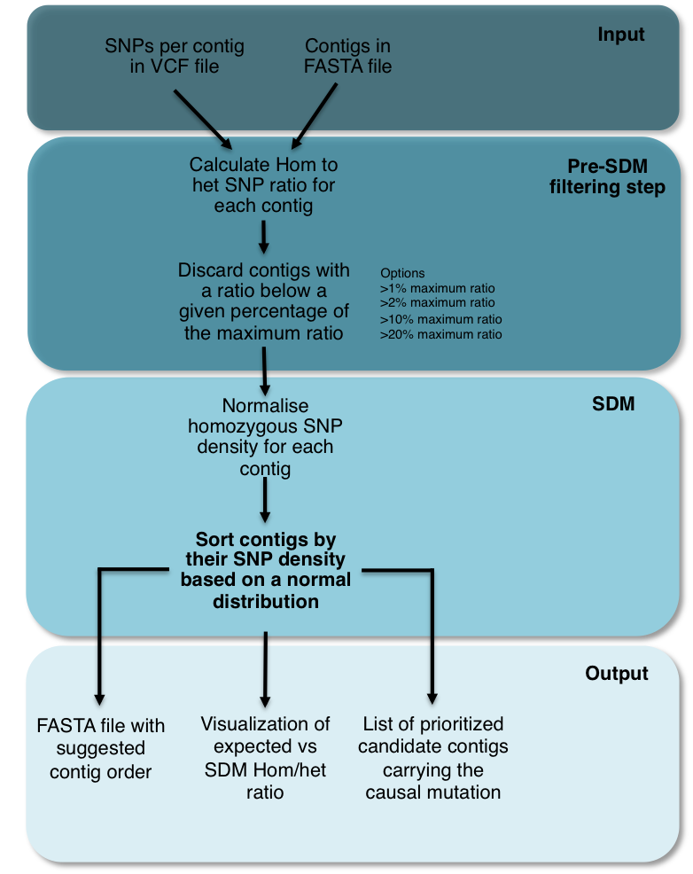

#Identification of genomic regions carrying a causal mutation in unordered genomes.

Whole genome sequencing using high-throughput sequencing (HTS) technologies offers powerful opportunities to study genetic variations. Mapping the mutations responsible for phenotypes is generally an involved and time-consuming process so researchers have developed user-friendly tools for mapping-by-sequencing, yet they are not applicable to organisms with non-sequenced genomes.

We introduce SDM (SNP Distribution Method), a reference independent method for rapid discovery of mutagen-induced mutations in typical forward genetics screens. SDM aims to order a disordered collection of HTS reads or contigs so that the fragment carrying the causative mutations can be identified. SDM uses typical distributions of homozygous SNPs that are linked to a phenotype-altering SNP in a non-recombinant region as a model to order the fragments. To implement and test SDM, we created model genomes with SNP density based on *Arabidopsis thaliana* chromosome and analysed fragments with size distribution similar to reads or contigs assembled from HTS sequencing experiments. SDM groups the contigs by their normalised SNP density and arranges them to maximise the fit to the expected SNP distribution. We analysed the procedure in existing data sets by examining SNP distribution in recent out-cross (Galvão et al. 2012; Uchida et al. 2014) and back-cross experiments (Allen et al. 2013; Monaghan et al. 2014) in *Arabidopsis thaliana* backgrounds. In all the examples we analysed, homozygous SNPs were normally distributed around the causal mutation. We used the real SNP densities obtained from these experiments to prove the efficiency and accuracy of SDM. The algorithm succeed in the identification of the genomic regions of small size (10-100 kb) containing the causative mutations.

#SNP Distribution Method


First, we used [model genomes](https://github.com/pilarcormo/SNP_distribution_method/tree/master/Small_genomes) composed by a set of unordered contigs and an ideal SNP density as starting point. [SDM](https://github.com/pilarcormo/SNP_distribution_method/blob/master/lib/SDM.rb) sorts the fragments by their SNP density values so that they follow a normal distribution. 

The SDM pipeline calculates the ratio hom/het for each contig and then uses this value as a threshold to discard the contigs located far from the causal mutation. We analysed the effect of [different thresholds](https://github.com/pilarcormo/SNP_distribution_method/blob/master/Small_genomes/arabidopsis_datasets/Analyse_effect_ratio/Pre_filtering.md)

We know the SNPs are clustered together around the causative mutation, then we can order the contigs by taking the 2 lowest values of SNP frecuency and moving them to the ends of the distribution. By repeting this step, we will potentially get to the highest SNP density values in those contigs were the causative mutation is more likely to be located. As contigs do not have a constant length, for the method to be effective, instead of using the absolute number of SNPs, I use a relative number by dividing the SNP density per contig by the number of nucleotides (length). 

Then, we tried SDM in in different [forward genetics screens](https://github.com/pilarcormo/SNP_distribution_method/tree/master/Reads) and analysed their [homozygous SNP distribution](https://github.com/pilarcormo/SNP_distribution_method/blob/master/Reads/qqplot.md). We defined 2 filtering steps to unmask the SNP density peak based on the [background SNPs](https://github.com/pilarcormo/SNP_distribution_method/blob/master/manage_vcf.rb) and [the elimination of the centromeres](https://github.com/pilarcormo/SNP_distribution_method/blob/master/remove_cent.rb). 

In order to choose the optimal contig size for the model genomes, we analysed the [N50 contig length in genome assemblies from 2013 until now](https://github.com/pilarcormo/SNP_distribution_method/tree/master/Contigs) 

We created [model genomes](https://github.com/pilarcormo/SNP_distribution_method/tree/master/arabidopsis_datasets/No_centromere) with the optimal contig size and the SNP density obtained from real forward genetic screens and ran [SDM on them](https://github.com/pilarcormo/SNP_distribution_method/blob/master/Results/SDM.md)


###Runing SDM



Run ```ruby SNP_distribution_method_variation.rb (1) (2) (3) (4) (5)```

1. **Input dataset folder** containing the input files -Contigs in FASTA file and SNPs in a VCF file-
2. name for the **output folder**
3. **Threshold - % of maximum ratio to discard contigs.**
	- 0 -> filtering step off. 
	- larger than 0 -> filtering step on.  If the filtering step is required, the threshold astringency is provided as an integer (1, 5, 10, 20). Each integer represents the percentage of the maximum ratio below which a contig will be discarded. In example, if 1 is specified, SDM will discard those contigs with a ratio falling below 1% of the maximum ratio while a value of 20 is more astringent  will discard those contigs with a ratio falling below 20% of the maximum ratio. If 1% is provided, after filtering, it will check if the filtering was enough for the specific set of contigs, in case it wasn't, it will automatically increase by 2 points the threshold (2%) and will repeat the filtering step.
4.  **Factor to calculate the ratio.** Float (1, 0.1, 0.01...). 
5.  **Type of cross.** Back or out

Example:

```
Looking for SNPs in (1)
Output will be in (2)
A factor of (4) will be used to calculate the ratio
(5)-cros selected
Filtering step on: (3)% selected
```

To test SDM, the input dataset folder (1) can be obtained by running [small_model_genome.rb](https://github.com/pilarcormo/SNP_distribution_method/blob/master/Small_genomes/small_model_genome.rb) as detailed in this [README file](https://github.com/pilarcormo/SNP_distribution_method/blob/master/Small_genomes/README.md). It will generate a FASTA file with the correctly ordered fragments, another FASTA file the shuffled fragments, text files with the list of homozygous and heterozygus SNPs and a VCF file with the SNPs. The model genomes generated to test SDM are in 
[Small_genomes/arabidopsis_datasets](https://github.com/pilarcormo/SNP_distribution_method/tree/master/Small_genomes/arabidopsis_datasets)

The output after running SDM will be a new FASTA file with the suggested order of contigs, and inside the output folder we will find :
 
- Text files for homozygous and heterozygous SNPs after sorting step (perm_hm and perm_ht) and for the hypothetical ratio (hyp_ratio). 
- Text files for homozygous and heterozygous SNPs after pre-filtering step (hm_snps_short, ht_snps_short) in the correctly ordered genome and  for the ratios in the correctly ordered fragments (ratio).
- A plot for the hypothetical SNP densities and ratio
- A QQ-plot comparing the correlation of the obtained SNP density and the expected normal distribution
- A plot comparing the real ratio distribution and the ratio distribution after running SDM 
- A text file (mutation) with the following information:
	 - Length of the group of contigs that form the peak of the distribution
	 - Contigs and positions where the mutation is likely to be found 	 
	 

###R scripts 

All the density plots, QQplots and histograms are described in the R scripts at [https://github.com/pilarcormo/SNP_distribution_method/R_scripts](https://github.com/pilarcormo/SNP_distribution_method/tree/master/R_scripts)


###Project dependencies

1. Ruby >= 2.0.0

2. Ruby gems:

	- bio >= 1.4.3.0001
	- bio-samtools >= 2.2.0
	- rinruby >= 2.0.3

3. R >= 3.1.1


