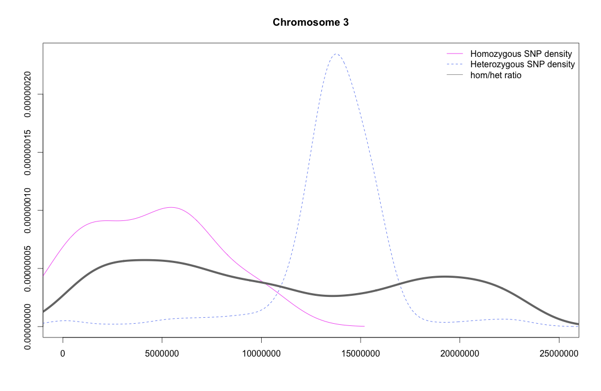
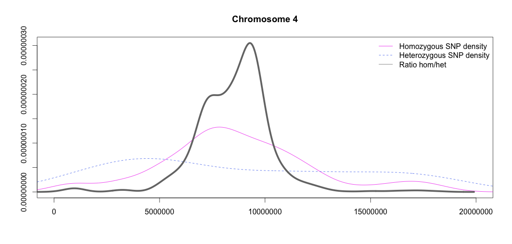
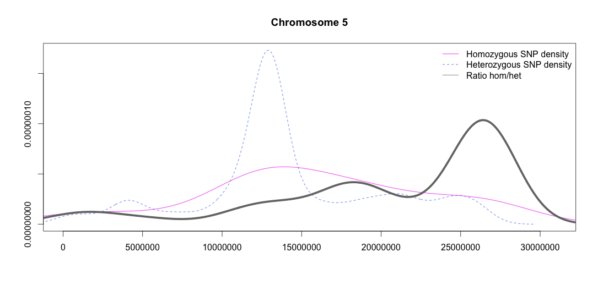

Results after parental filtering and centromere removal
====

### BCF2 

[Allen et al](http://www.ncbi.nlm.nih.gov/pmc/articles/PMC3772335/#SM3)

EMS mutagenesis. BCF2 reads and Landsberg erecta (Ler) background. 

**Chromosome 3**

###OCF2 

[Galvão et al](http://onlinelibrary.wiley.com/doi/10.1111/j.1365-313X.2012.04993.x/full#ss9)

EMS mutagenesis. OCF2 reads and  mir159a parent as background. 

**Chromosome 2**

###sup1

[Uchida et al](http://pcp.oxfordjournals.org/content/52/4/716.long)

EMS mutagenesis. sup#1 and sup#2 mutants. Arabidopsis Wassilewskija (Ws) and Col-Tasaka (Col-T) background. 

**Chromosome 4**

#####sup#1

###bak1-5 mutants

#####mob1
**Chromosome 5**

#####mob2
**Chromosome 5**

