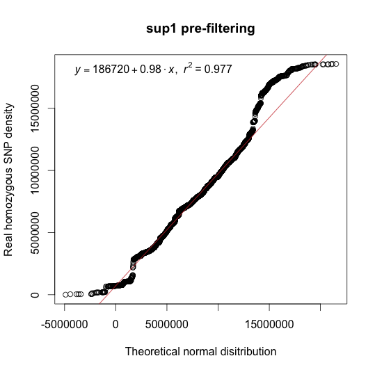
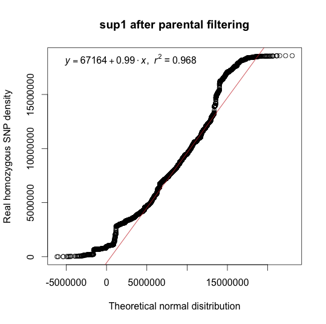
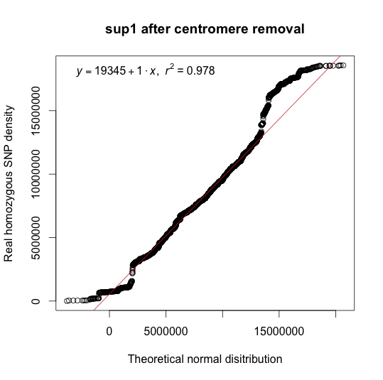
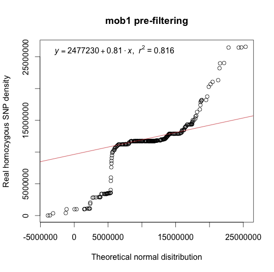
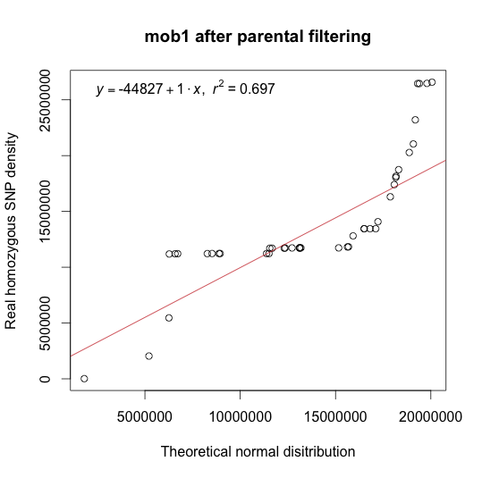
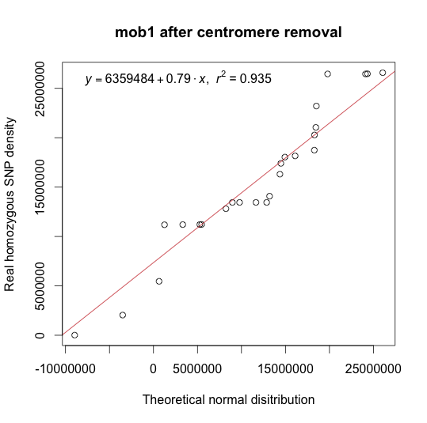
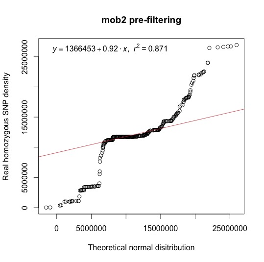
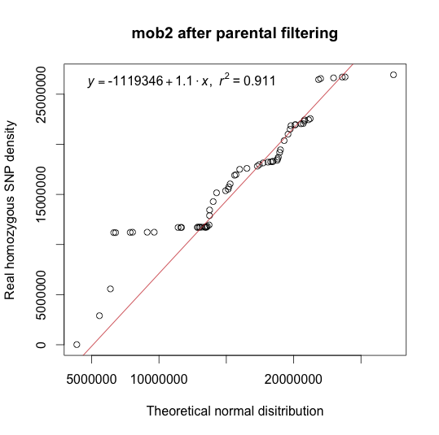
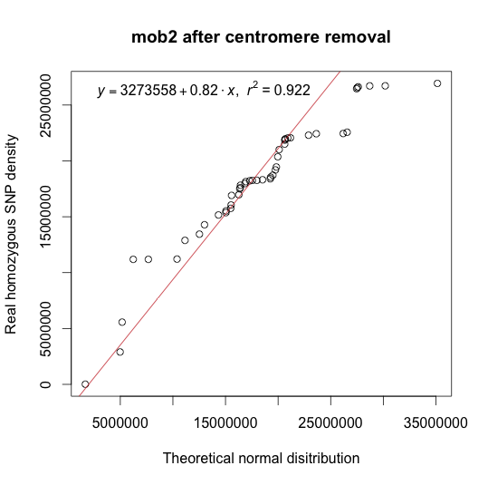

QQ-plots 
====
R code plot the probability plots (QQ-plots) with the linear regression can be found at [https://github.com/pilarcormo/SNP_distribution_method/blob/master/R_scripts/qqplot.R](https://github.com/pilarcormo/SNP_distribution_method/blob/master/R_scripts/qqplot.R)

```
##qqplot and qqline2
qqline2 <- function(x, y, probs = c(0.25, 0.75), qtype = 7, ...)
{
  stopifnot(length(probs) == 2)
  x2 <- quantile(x, probs, names=FALSE, type=qtype, na.rm = TRUE)
  y2 <- quantile(y, probs, names=FALSE, type=qtype, na.rm = TRUE)
  slope <- diff(y2)/diff(x2)
  int <- y2[1L] - slope*x2[1L]
  abline(int, slope, ...)
}
leg_r2 <- function(k) #Generate legend with the equation of the line and the value of r square
{
  legend(x = "topleft", bty = "n",
         legend = substitute(italic(y) == a + b %.% italic(x)*","~~italic(r)^2~"="~r2, 
                             list(a = format(coef(k)[1], digits = 2), 
                                  b = format(coef(k)[2], digits = 2), 
                                  r2 = format(summary(k)$r.squared, digits = 3))))
}
qqplot_line <- function(y, title)
{
  x <- rnorm(length(y), mean(y), sd(y))
  df <- data.frame(x, y)
  V = qqplot(x, y, main = title, ylab="Real homozygous SNP density", xlab = "Theoretical normal disitribution")
  l <- qqline2(x, y, col = 'brown3') 
  fg <- data.frame(V$x, V$y)
  k <- lm(V$y ~ V$x)
  len <- leg_r2(k)
} 
```

###1. sup1 
[Uchida et al](http://pcp.oxfordjournals.org/content/52/4/716.long)

`hm_pa <- read.table("~/SNP_distribution_method/Reads/Aw_sup1-2/sup1_chromosome4/hm.txt", quote="\"")`

`hm_cen <- read.table("~/SNP_distribution_method/Reads/Aw_sup1-2/filter2_chromosome4/hm_nocen.txt", quote="\"")`

`hm_pre <- read.table("~/SNP_distribution_method/Reads/Aw_sup1-2/filter2_chromosome4/hm.txt", quote="\"")`


```y_pa <- c(hm_pa$V1)
y_cen <- c(hm_cen$V1)
y_pre <- c(hm_pre$V1)
q1 <- list(qqplot_line(y_pre, "sup1 pre-filtering"))
q2 <- list(qqplot_line(y_pa, "sup1 after parental filtering"))
q3 <- list(qqplot_line(y_cen, "sup1 after centromere removal"))```






###OCF2
[Galvão et al](http://onlinelibrary.wiley.com/doi/10.1111/j.1365-313X.2012.04993.x/full#ss9)
 

`hm_pa <- read.table("~/SNP_distribution_method/Reads/OCF2/OCF2_chromosome2/Interesting_2/hm.txt", quote="\"")`

`hm_cen <- read.table("~/SNP_distribution_method/Reads/OCF2/OCF2_chromosome2/Interesting_2/hm_nocen.txt", quote="\"")`

`hm_pre <- read.table("~/SNP_distribution_method/Reads/OCF2/OCF2_chromosome2/hm.txt", quote="\"")`

```y_pa <- c(hm_pa$V1)
y_cen <- c(hm_cen$V1)
y_pre <- c(hm_pre$V1)
q1 <- list(qqplot_line(y_pre, "OCF2 pre-filtering"))
q2 <- list(qqplot_line(y_pa, "OCF2 after parental filtering"))
q3 <- list(qqplot_line(y_cen, "OCF2 after centromere removal"))```


###mob mutants 


#####mob1

`hm_pa <- read.table("~/SNP_distribution_method/Reads/m_mutants/C_chromosome5/interesting_5/hm.txt", quote="\"")`

`hm_pre <- read.table("~/SNP_distribution_method/Reads/m_mutants/C_chromosome5/hm.txt", quote="\"")`

`hm_cen <- read.table("~/SNP_distribution_method/Reads/m_mutants/C_chromosome5/interesting_5/hm_nocen.txt", quote="\"")`

```y_pa <- c(hm_pa$V1)
y_cen <- c(hm_cen$V1)
y_pre <- c(hm_pre$V1)
q1 <- list(qqplot_line(y_pre, "mob1 pre-filtering"))
q2 <- list(qqplot_line(y_pa, "mob1 after parental filtering"))
q3 <- list(qqplot_line(y_cen, "mob1 after centromere removal"))```







#####mob2
`hm_pa <- read.table("~/SNP_distribution_method/Reads/m_mutants/B_chromosome5/interesting_5/hm.txt", quote="\"")`

`hm_pre <- read.table("~/SNP_distribution_method/Reads/m_mutants/B_chromosome5/hm.txt", quote="\"")`

`hm_cen <- read.table("~/SNP_distribution_method/Reads/m_mutants/B_chromosome5/interesting_5/hm_nocen.txt", quote="\"")`

```y_pa <- c(hm_pa$V1)
y_cen <- c(hm_cen$V1)
y_pre <- c(hm_pre$V1)
q1 <- list(qqplot_line(y_pre, "mob2 pre-filtering"))
q2 <- list(qqplot_line(y_pa, "mob2 after parental filtering"))
q3 <- list(qqplot_line(y_cen, "mob2 after centromere removal"))```





###BCF2


`hm_pa <- read.table("~/SNP_distribution_method/Reads/BCF2/BCF2_chromosome3/Interesting_3/hm.txt", quote="\"")`

`hm_pre <- read.table("~/SNP_distribution_method/Reads/BCF2/BCF2_chromosome3/hm.txt", quote="\"")`

`hm_cen <- read.table("~/SNP_distribution_method/Reads/BCF2/BCF2_chromosome3/Interesting_3/hm_nocen.txt", quote="\"")`

```y_pa <- c(hm_pa$V1)
y_cen <- c(hm_cen$V1)
y_pre <- c(hm_pre$V1)
q1 <- list(qqplot_line(y_pre, "BCF2 pre-filtering"))
q2 <- list(qqplot_line(y_pa, "BCF2 after parental filtering"))
q3 <- list(qqplot_line(y_cen, "BCF2 after centromere removal"))```


