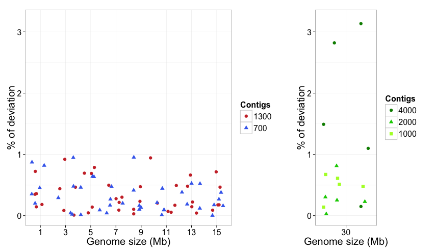

#Modelling SDM using small genomes


###Creating a model genome

For our purpose, a mutant individual should be crossed to a non-mutant parental line (either the same ecotype -backcross- or a distant ecotype -outcross-). The offspring of this cross would give rise to a recombinant population which will segregate for the mutant phenotype. Due to linkage to the phenotype altering SNP, the remaining linked homozygous SNPs will be distributed around it generating a high homozygous SNP density in this non-recombinant genomic region. Consequently, the homozygous/heterozygous SNP ratio will be higher in the area where the SNP of interest is located.

To identify the causal mutation in the model genomes, we used idealised SNP distributions. We observed that homozygous SNPs around the causative mutation followed a normal distribution, with the causal mutation in the middle of the distribution in the non-recominant region.  For our model, we assumed that heterozygous SNPs followed a uniform distribution, with no specific contribution to the general SNP density.

Running ```ruby small_model_genome.rb {dataset_name} {genome_length} {contig_size}``` will generate a new model genome based on *A. thaliana* chromosome I using the TAIR10 chromosome I as input. The FASTA sequence for this chromosome  can be found at [https://github.com/pilarcormo/SNP_distribution_method/blob/master/Small_genomes/TAIR10_chr1.fasta](https://github.com/pilarcormo/SNP_distribution_method/blob/master/Small_genomes/TAIR10_chr1.fasta)

The model genome will be created at  SNP_distribution_method/arabidopsis_datasets/{dataset_name} and will include:
- a FASTA file (frags.fasta) with the sequences of each fragment
- a FASTA file with the shuffled fragments (frags_shuffled.fasta)
-  a VCF file with the SNPs on each fragment
-  a text file (info.txt) containing the homozygous and heterozygous SNPs densities used to create the genome and the contig size used.
-  2 text files (hm_snps.txt and ht_snps.txt) with the homozygous and heterozygous SNP positions in the model genome. 

In the INFO field of the VCF, each SNP has been given an allele frequency (AF). Heterozygous SNPs will generally have AF = ~0.5, and homozygous AF = ~1.0, but this will vary with pooled data. In the model, each SNP has been given an allele frequency of exactly 0.5 or 1.0. The variables hm_r and ht_r contain the R code needed to create the model homozygous and heterozygous SNP distributions respectively. The variable contig_size provides the minimum size for contigs, where the maximum size is double this value, and each contig's size is randomly chosen within this range. Information obtained from [https://github.com/edwardchalstrey1/fragmented_genome_with_snps](https://github.com/edwardchalstrey1/fragmented_genome_with_snps). 


######1-15 Mb genomes

We created model genomes of different sizes between 1 and 15 Mb. A SNP density of 1 SNP/500 bp was used using the following R code:

```
# Create the lists of homozygous and heterozygous SNPs
hm_r = "hm <- rnorm(#{snp}, #{size/2}, #{snp*2})" 
ht_r = "ht <- runif(#{snp}, 1, #{size})"   
```
where size is the genome size in bp and snp is ```snp = (genome_size/1000)*2```

The shell script used to create the 5 replicates for each genome size was as follows:

```
for i in {1..5} 
do
	ruby small_model_genome.rb 1Mb_$i 1000000 1000
	ruby small_model_genome.rb 1Mb_A_$i 1000000 500
	ruby small_model_genome.rb 3Mb_$i 3000000 3000
	ruby small_model_genome.rb 3Mb_A_$i 3000000 1500
	ruby small_model_genome.rb 5Mb_$i 5000000 5000
	ruby small_model_genome.rb 5Mb_A_$i 5000000 2500
	ruby small_model_genome.rb 7Mb_$i 7000000 7000
	ruby small_model_genome.rb 7Mb_A_$i 7000000 3500
	ruby small_model_genome.rb 9Mb_$i 9000000 9000
	ruby small_model_genome.rb 9Mb_A_$i 9000000 4500
	ruby small_model_genome.rb 11Mb_$i 11000000 11000
	ruby small_model_genome.rb 11Mb_A_$i 11000000 5500
	ruby small_model_genome.rb 13Mb_$i 13000000 13000
	ruby small_model_genome.rb 13Mb_A_$i 13000000 6500
	ruby small_model_genome.rb 15Mb_$i 15000000 15000
	ruby small_model_genome.rb 15Mb_A_$i 15000000 7500
done 
```

Therefore, the folders without letter contain genomes with an approximate number of 700 contigs and the folders with an "A" contain genomes with 1300 contigs, approximately. They can be found at The resulting model genomes generated were deposited in a Github repository at [https://github.com/pilarcormo/SNP_distribution_method/tree/master/Small_genomes/arabidopsis_datasets/1-15Mb](https://github.com/pilarcormo/SNP_distribution_method/tree/master/Small_genomes/arabidopsis_datasets/1-15Mb). 

######30 Mb genomes

We created model genomes based on the whole chromosome I from *A.thaliana* with different contig sizes. Instead of providing a genome length, the whole chromosome size is considered. For this, run ```chr1_model_genome.rb {dataset_name} {contig_size}```

The shell script used to create the 5 replicates for each genome size was as follows:

```
for i in {1..5} 
do
	ruby model_genome.rb chr1_1_$i 20000
	ruby model_genome.rb chr1_A_$i 10000
	ruby model_genome.rb chr1_B_$i 5000
done
```

The genomes generated are avialable at 
[https://github.com/pilarcormo/SNP_distribution_method/tree/master/Small_genomes/arabidopsis_datasets/30Mb](https://github.com/pilarcormo/SNP_distribution_method/tree/master/Small_genomes/arabidopsis_datasets/30Mb)


######Causal mutation not located in the mean
```
for i in {1..5} 
do
	ruby model_genome.rb chr1_C_$i 10000
	ruby model_genome.rb chr1_E_$i 10000
done
```
The 30 Mb genomes under the name _C and _E were created with the homozygous SNP mutation moved to the right tail and the left tail (respectively). Instead of defining the mean of the rnorm distribution in the middle of the distribution, this value was shifted around a 20% to the right and left.


<table>
 <tr><th>Name <th>Contig length</th> <th>Mean of rnorm distribution</th>
 <tr><th>arabidopsis_datastets/30Mb/chr1_C_i <th>10000 </th> <th>20000000</th>
 <tr><th>arabidopsis_datastets/30Mb/chr1_E_i <th>10000 </th> <th>10000000</th>
</table>

A [pre-filtering step](https://github.com/pilarcormo/Small_genomes/arabidopsis_datasets/Analyse_effect_ratio) based on the homozygous to heterozygous SNPs ratio was incorporated to SDM to remove the contigs that are surrounding the causal mutation (those located in the tails of the normal distribution of homozygous SNPs). This filtering step removes the contigs with a hom/het ratio below a given percentage of the maximum ratio in the assembly.


###Runing SDM with the model genomes

The command lines to run SDM on the model genomes are available at [https://github.com/pilarcormo/SNP_distribution_method/blob/master/Small_genomes/SDM.sh](https://github.com/pilarcormo/SNP_distribution_method/blob/master/Small_genomes/SDM.sh)

Run ```ruby SNP_distribution_method_variation.rb (1) (2) (3)```

1. **Input dataset folder** containing the input files 
2. name for the **output folder**
3. **Threshold = provide one of the following 0, 1, 5, 10, 20.**
	- 0 -> filtering step off. 
	- larger than 0 -> filtering step on.  If the filtering step is required, the threshold astringency is provided as an integer (1, 5, 10, 20). Each integer represents the percentage of the maximum ratio below which a contig will be discarded. In example, if 1 is specified, SDM will discard those contigs with a ratio falling below 1% of the maximum ratio while a value of 20 is more astringent  will discard those contigs with a ratio falling below 20% of the maximum ratio. 
4.  **Factor to calculate the ratio.** Float (1, 0.1, 0.01...). 
5.  **Type of cross** (two options: back or out). 

To test SDM, the input dataset folder (1) is obtained by running the model_genome explained above. It will generate a FASTA file with the correctly ordered fragments, another FASTA file the shuffled fragments, text files with the list of homozygous and heterozygus SNPs and a VCF file with the SNPs. In the model genomes, the pre-filtering step (3) was not initially used (threshold = 0), the factor (4) was set to 1 and the type of cross (5) was fixed to back. 

The output after running SDM will be a new FASTA file with the suggested order of contigs, and inside the output folder we will have: 

- Text files for homozygous and heterozygous SNPs after sorting step (perm_hm and perm_ht). 
- Text files for homozygous and heterozygous SNPs after pre-filtering step (hm_snps_short, ht_snps_short) in the correctly ordered genome. If the threshold is set to 0, those will be equal to the initial input files. 
- Plots comparing the hypothetical SNP densities and the expected densities. 
- A plot comparing the real ratio distribution and the ratio distribution after running SDM 
	 
######Deviation from causal mutation


```
library(ggplot2)
library(grid)
library(gridExtra)
```
```
deviations <- read.csv("~/SNP_Distribution_method/Small_genomes/arabidopsis_datasets/1-15Mb.csv")
deviations_30 <- read.csv("~/SNP_Distribution_method/Small_genomes/arabidopsis_datasets/30Mb.csv")
deviations$Genome_size <- factor(deviations$Genome_size, labels = c("1", "3", "5", "7", "9", "11", "13", "15"))
deviations$Contigs <- factor(deviations$Contigs, labels = c("1300", "700"))
deviations_30$Genome_size <- factor(deviations_30$Genome_size, labels = c("30"))
deviations_30$Contigs <- factor(deviations_30$Contigs, labels = c("4000", "2000", "1000"))
```
```
Palette <- c('brown3',"royalblue2")
Palette2 <- c('green4',"green3", "greenyellow")
g <- ggplot(deviations, aes(x = Genome_size, y = Deviation, shape = Contigs, colour = Contigs)) + geom_jitter(size = 3) + ylim(0, 3.2) + labs(x = "Genome size (Mb)",  y = "% of deviation") + theme_bw() + scale_colour_manual(values=Palette) + theme(text = element_text(size=20))
h <- ggplot(deviations_30, aes(x = Genome_size, y = Deviation, shape = Contigs, colour = Contigs)) +  geom_jitter(size = 3) + ylim(0, 3.2) + labs(x = "Genome size (Mb)",  y = "% of deviation") + theme_bw() + scale_colour_manual(values=Palette2) + theme(text = element_text(size=20))
gh <- grid.arrange(g , h, ncol=2, heights=c(1, 10), widths =c(2,1), as.table =TRUE)
```



