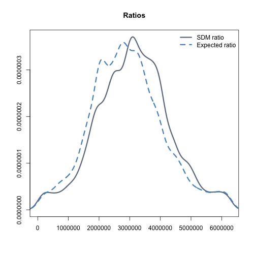
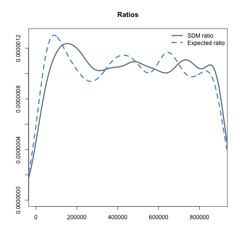

###Analysing effect of pre-filtering step

Model genomes based on Arabidopsis chromosome 1 (~30 Mb). 

SDM pipeline calculates the ratio hom/het for each contig and then uses this value as a threshold to discard the contigs located far from the causal mutation. 
The ratio of homozygous to heterozygous SNPs on a contig n is defined as the sum homozygous SNPs on n plus 1 divided by the sum of heterozygous SNPs plus 1. An allele frequency of 0.8 or larger is required for homozygous SNPs:

If the filtering step is required, the threshold astringency is provided as an integer (1, 5, 10, 20). Each integer represents the percentage of the maximum ratio below which a contig will be discarded. In example, if 1 is specified, SDM will discard those contigs with a ratio falling below 1% of the maximum ratio while a value of 20 is more astringent  will discard those contigs with a ratio falling below 20% of the maximum ratio. 

- 1 -> threshold = 1% of the maximum ratio. Divide by 100 
- 5 -> threshold = 5% of the maximum ratio. Divide by 50
- 10 -> threshold = 10% of the maximum ratio. Divide by 10
- 20 -> threshold = 20% of the maximum ratio. Divide by 5

<table>
 <tr><th>Name <th>Contig length</th> <th>Mean of rnorm distribution</th>
 <tr><th>chr1_right <th>10000 </th> <th>20000000</th>
 <tr><th>chr1_left <th>10000 </th> <th>10000000</th>
   
</table>

###1% of the maximum ratio

###5% of the maximum ratio

###10% of the maximum ratio

###20% of the maximum ratio

